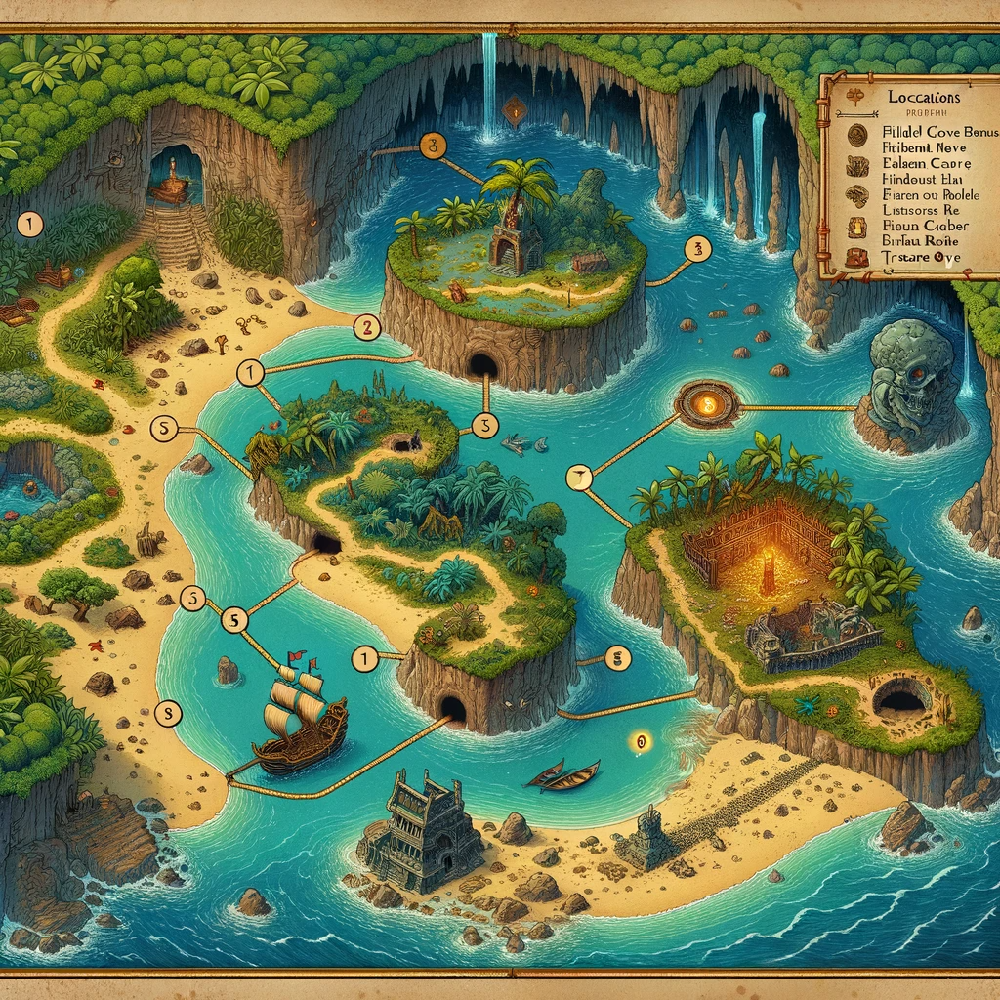
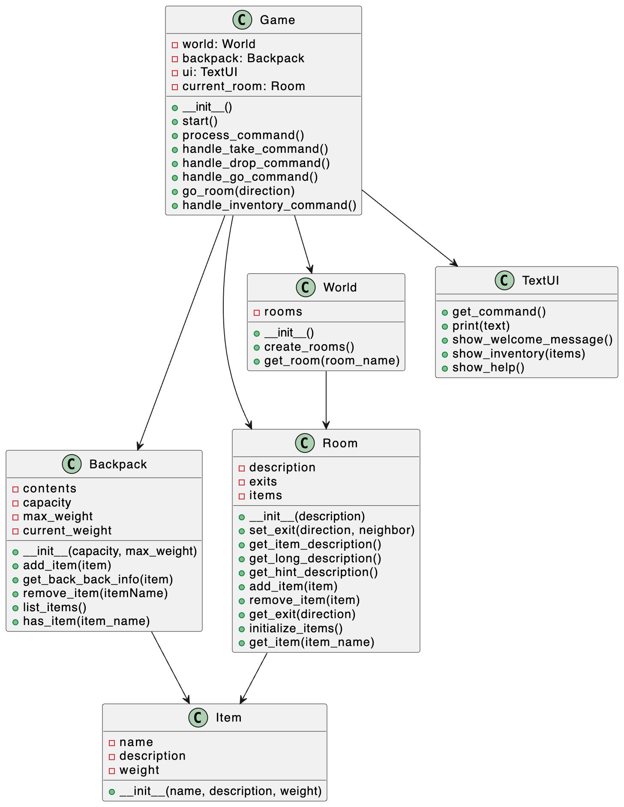

# Project Report: Caverns of the Golden Isle

## Candidate Number: 284038

### 1. Problem Statement and Game Overview
"Caverns of the Golden Isle" is an immersive text-based adventure game that propels players into the role of a swashbuckling pirate on a quest for hidden treasure within a mysterious island's cave system. This game challenges the player with exploration, strategic item management, and puzzle-solving. The primary goal is to uncover the elusive treasure through navigating an array of intriguing locations such as sandy beaches, dense jungles, ancient ruins, and secretive caves.

### 2. Game Launch and Playthrough Instructions
To begin the game, execute `game.py` within a Python environment. The game is self-contained and independent of external libraries. Player interaction is facilitated through a text-based interface, with commands for exploration, item collection, and puzzle resolution. Guidance on command usage is provided within the game.

### 3. Game World Map
The game world of "Caverns of the Golden Isle" comprises a network of interconnected locations, each presenting unique challenges and opportunities for discovery. Central areas include the Beach, Jungle, Hidden Cove, Ancient Ruins, Mysterious Cave, and more. The design of the map encourages non-linear exploration and strategic decision-making as players navigate the game's environment.

### 4. UML Class Diagram

### 5. Modifications to Starting Program and New Classes
**Class Descriptions:**
- `Backpack.py`: Manages the player's inventory, monitoring item capacity and weight.
- `Item.py`: Defines items with distinct characteristics including name, description, and weight.
- `Room.py`: Depicts various game locations, each with unique features and puzzles.
- `TextUI.py`: Manages the game's text-based interface for player interaction.
- `World.py`: Constructs the game's landscape, connecting rooms and facilitating exploration.
- `Game.py`: Integrates all game components, orchestrating the core gameplay.
- Testing Suites (`test_backpack.py`, `test_game.py`, `test_room.py`): Verify the functionality and robustness of their respective classes.

### 6. Interesting Design Features
"Caverns of the Golden Isle" includes a range of compelling design features:
- **Puzzles/Minigames:** Within the game's exploration mechanics, players encounter various puzzles that require the strategic use of items and interpretation of hints to unlock new areas or acquire key items.
- **Unusual Data Structures:** The game employs custom data structures for managing gameplay elements, such as the dynamic storage of items in the Backpack class and the interconnected room system within the World class.
- **Creative Game Mechanics:** The text-based user interface offers a distinctive gameplay experience, utilizing command-driven mechanics and rich narrative descriptions to immerse players fully in the game's thematic world. The inventory system presents strategic considerations based on item weight and utility, enhancing the depth of gameplay.

### 7. Problems or Issues Encountered
Developing an intuitive text interface and ensuring seamless integration between game components were among the main challenges encountered. Iterative testing and refining of game logic and mechanics were instrumental in addressing these challenges.

### 8. Testing Evidence
Extensive unit testing was performed for key game components:
- `TestBackpack`: Validates the inventory management system, testing item capacity and weight constraints.
- `TestGame`: Assesses the functionality of game commands, ensuring proper navigation and interaction.
- `TestRoom`: Evaluates room functionalities, including item management and exit navigation.
Testing played a crucial role in identifying and resolving issues with inventory management and room navigation.

